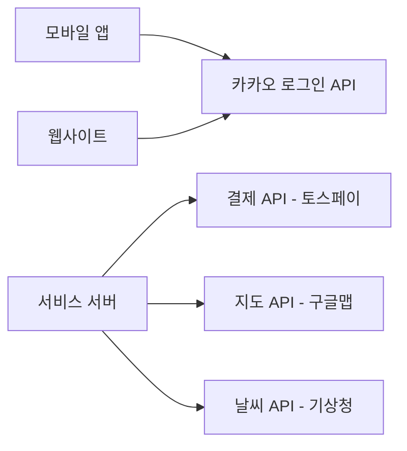
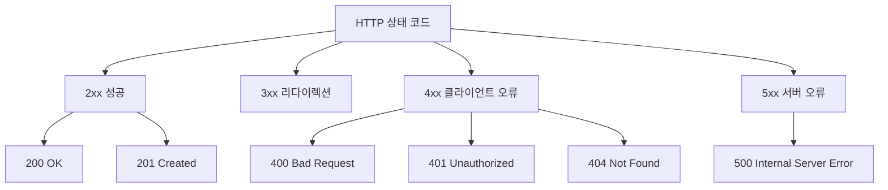
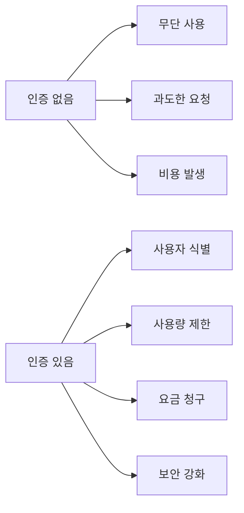
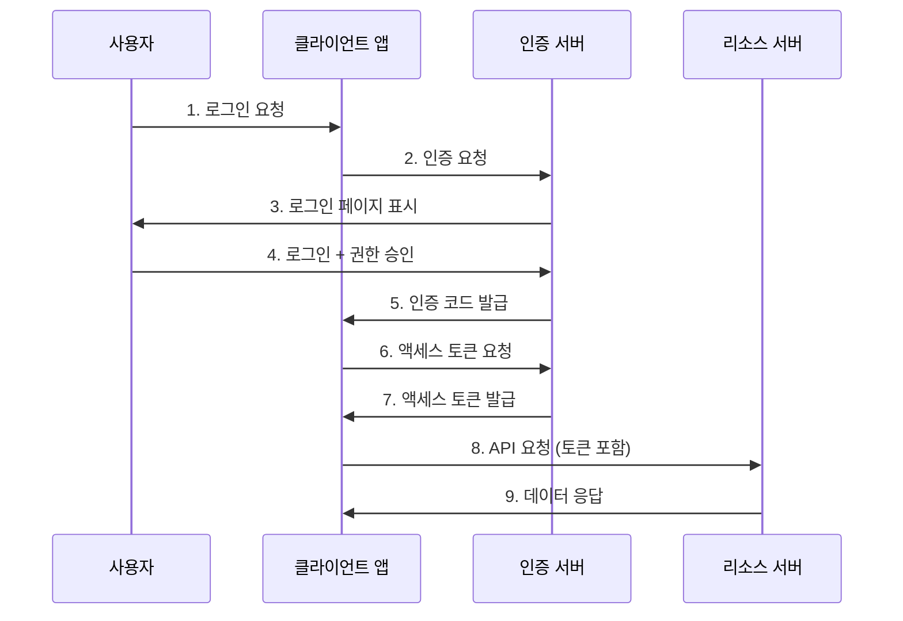

# API 이해와 활용

기획자 및 초보 개발자를 위한 실전 가이드

---

## 목차
1. API란 무엇인가?
2. 프로토콜과 웹 API
3. REST API 이해하기
4. API 인증 방법
5. API 활용 팁

---

## 1. API란 무엇인가?

### 1.1 API의 정의

**API (Application Programming Interface)**는 소프트웨어 간의 소통 방법을 정의한 규칙입니다.

```
실생활 비유: 레스토랑

고객 (클라이언트)
    ↓
  메뉴판 (API 문서)
    ↓
  웨이터 (API)
    ↓
주방 (서버/시스템)
```

### 1.2 왜 API가 필요한가?

- **재사용성**: 이미 만들어진 기능을 다시 만들 필요 없음
- **보안**: 내부 로직을 숨기고 필요한 부분만 노출
- **효율성**: 각자의 전문 분야에 집중 가능
- **확장성**: 다양한 플랫폼에서 동일한 기능 활용

### 1.3 API의 실제 사례



**일상에서 만나는 API:**
- 카카오톡/구글 로그인
- 결제 시스템 (토스, 페이팔)
- 지도 서비스 (구글맵, 네이버맵)
- 날씨 정보
- 주식 시세 정보

---

## 2. 프로토콜과 웹 API

### 2.1 프로토콜(Protocol)이란?

통신 규칙의 약속입니다. 마치 "한국어로 대화하자"는 약속처럼요.

```
프로토콜의 예:
- HTTP/HTTPS: 웹 브라우저와 서버 간 통신
- FTP: 파일 전송
- SMTP: 이메일 전송
- WebSocket: 실시간 양방향 통신
```

### 2.2 HTTP 프로토콜

웹 API의 기본이 되는 프로토콜입니다.

```
HTTP 요청 구조:

GET /api/users/123 HTTP/1.1
Host: api.example.com
Authorization: Bearer abc123token
Content-Type: application/json
```

```
HTTP 응답 구조:

HTTP/1.1 200 OK
Content-Type: application/json

{
  "id": 123,
  "name": "홍길동",
  "email": "hong@example.com"
}
```

### 2.3 HTTP 메서드 (동사)

| 메서드 | 의미 | 사용 예시 |
|--------|------|-----------|
| GET | 조회 | 사용자 정보 가져오기 |
| POST | 생성 | 새 게시글 작성 |
| PUT | 전체 수정 | 프로필 전체 업데이트 |
| PATCH | 부분 수정 | 이름만 변경 |
| DELETE | 삭제 | 계정 삭제 |

### 2.4 HTTP 상태 코드



**자주 보는 상태 코드:**
- `200 OK`: 성공
- `201 Created`: 생성 성공
- `400 Bad Request`: 잘못된 요청
- `401 Unauthorized`: 인증 필요
- `403 Forbidden`: 권한 없음
- `404 Not Found`: 리소스 없음
- `500 Internal Server Error`: 서버 오류

---

## 3. REST API 이해하기

### 3.1 REST란?

**REST (Representational State Transfer)**
- 웹의 장점을 최대한 활용하는 API 설계 방식
- Roy Fielding이 2000년 박사 논문에서 제안

### 3.2 REST의 핵심 원칙

```
1. 자원(Resource) 기반
   - 모든 것을 자원으로 표현
   - URI로 자원을 식별

2. HTTP 메서드 활용
   - GET, POST, PUT, DELETE 등

3. 무상태(Stateless)
   - 각 요청은 독립적
   - 서버는 클라이언트 상태를 저장하지 않음

4. 계층화(Layered System)
   - 클라이언트는 중간 서버를 알 필요 없음
```

### 3.3 RESTful API 설계 예시

**좋은 예 (RESTful):**

```
GET    /api/users              # 사용자 목록 조회
GET    /api/users/123          # 특정 사용자 조회
POST   /api/users              # 새 사용자 생성
PUT    /api/users/123          # 사용자 전체 수정
PATCH  /api/users/123          # 사용자 부분 수정
DELETE /api/users/123          # 사용자 삭제

GET    /api/users/123/posts    # 특정 사용자의 게시글 목록
POST   /api/users/123/posts    # 특정 사용자의 새 게시글 작성
```

**나쁜 예 (Non-RESTful):**

```
GET  /api/getUser?id=123
POST /api/createUser
POST /api/updateUser
POST /api/deleteUser
GET  /api/user/delete/123
```

### 3.4 실전 예제 코드

#### Python (requests 라이브러리)

```python
import requests
import json

BASE_URL = 'https://api.example.com'

# 1. 사용자 목록 조회
def get_users():
    response = requests.get(f'{BASE_URL}/users')
    return response.json()

# 2. 특정 사용자 조회
def get_user(user_id):
    response = requests.get(f'{BASE_URL}/users/{user_id}')
    return response.json()

# 3. 새 사용자 생성
def create_user(user_data):
    headers = {'Content-Type': 'application/json'}
    response = requests.post(
        f'{BASE_URL}/users',
        headers=headers,
        data=json.dumps(user_data)
    )
    return response.json()

# 4. 사용자 정보 수정
def update_user(user_id, update_data):
    headers = {'Content-Type': 'application/json'}
    response = requests.patch(
        f'{BASE_URL}/users/{user_id}',
        headers=headers,
        data=json.dumps(update_data)
    )
    return response.json()

# 5. 사용자 삭제
def delete_user(user_id):
    response = requests.delete(f'{BASE_URL}/users/{user_id}')
    return response.status_code == 204
```

---

## 4. API 인증 방법

### 4.1 왜 인증이 필요한가?



### 4.2 주요 인증 방식

#### 1) API Key 방식

가장 단순한 방식으로, 고유한 키를 발급받아 사용합니다.

```python
import requests

# 헤더에 포함
response = requests.get(
    'https://api.example.com/data',
    headers={'X-API-Key': 'your-api-key-here'}
)

# 쿼리 파라미터로 포함
response = requests.get(
    'https://api.example.com/data',
    params={'api_key': 'your-api-key-here'}
)
```

**장점:**
- 구현이 간단
- 빠른 적용 가능

**단점:**
- 보안이 약함 (키 노출 시 위험)
- 세밀한 권한 제어 어려움

**실제 사례: OpenWeatherMap API**

```python
import requests
import os
from dotenv import load_dotenv

# .env 파일에서 환경 변수 로드
load_dotenv()

API_KEY = os.getenv('OPENWEATHER_API_KEY')
city = 'Seoul'

def get_weather():
    if not API_KEY:
        print("환경 변수 OPENWEATHER_API_KEY가 설정되지 않았습니다.")
        return
    
    url = 'https://api.openweathermap.org/data/2.5/weather'
    params = {
        'q': city,
        'appid': API_KEY,
        'units': 'metric',
        'lang': 'kr'
    }
    
    response = requests.get(url, params=params)
    data = response.json()
    
    print(f"{city} 날씨: {data['weather'][0]['description']}")
    print(f"온도: {data['main']['temp']}°C")

get_weather()
```

#### 2) OAuth 2.0

사용자의 동의를 받아 제3자 서비스에 접근 권한을 부여하는 방식입니다.



**실제 사례: 구글 로그인**

```python
import requests
import os
from fastapi import FastAPI, Request
from fastapi.responses import RedirectResponse, JSONResponse
import urllib.parse
from dotenv import load_dotenv

# .env 파일에서 환경 변수 로드
load_dotenv()

app = FastAPI()

# 환경 변수에서 설정 로드
GOOGLE_CLIENT_ID = os.getenv('GOOGLE_CLIENT_ID')
GOOGLE_CLIENT_SECRET = os.getenv('GOOGLE_CLIENT_SECRET')
REDIRECT_URI = os.getenv('GOOGLE_REDIRECT_URI', 'https://yourapp.com/callback')

# 1. 구글 로그인 페이지로 리다이렉트
@app.get('/login')
def login_with_google():
    if not GOOGLE_CLIENT_ID:
        return JSONResponse(
            content={"error": "환경 변수 GOOGLE_CLIENT_ID가 설정되지 않았습니다."},
            status_code=500
        )
    
    scope = 'profile email'
    
    params = {
        'client_id': GOOGLE_CLIENT_ID,
        'redirect_uri': REDIRECT_URI,
        'response_type': 'code',
        'scope': scope
    }
    
    auth_url = 'https://accounts.google.com/o/oauth2/v2/auth?' + urllib.parse.urlencode(params)
    return RedirectResponse(url=auth_url)

# 2. 콜백에서 인증 코드 받기
@app.get('/callback')
def handle_callback(request: Request):
    if not all([GOOGLE_CLIENT_ID, GOOGLE_CLIENT_SECRET]):
        return JSONResponse(
            content={"error": "환경 변수가 설정되지 않았습니다."},
            status_code=500
        )
    
    code = request.query_params.get('code')
    
    if not code:
        return JSONResponse(
            content={"error": "인증 코드가 제공되지 않았습니다."},
            status_code=400
        )
    
    # 3. 액세스 토큰 교환
    token_data = {
        'code': code,
        'client_id': GOOGLE_CLIENT_ID,
        'client_secret': GOOGLE_CLIENT_SECRET,
        'redirect_uri': REDIRECT_URI,
        'grant_type': 'authorization_code'
    }
    
    token_response = requests.post(
        'https://oauth2.googleapis.com/token',
        data=token_data
    )
    
    if token_response.status_code != 200:
        return JSONResponse(
            content={"error": "토큰 교환 실패", "details": token_response.text},
            status_code=token_response.status_code
        )
    
    access_token = token_response.json()['access_token']
    
    # 4. 액세스 토큰으로 API 호출
    user_info_response = requests.get(
        'https://www.googleapis.com/oauth2/v2/userinfo',
        headers={'Authorization': f'Bearer {access_token}'}
    )
    
    if user_info_response.status_code != 200:
        return JSONResponse(
            content={"error": "사용자 정보 조회 실패", "details": user_info_response.text},
            status_code=user_info_response.status_code
        )
    
    user = user_info_response.json()
    print(user)
    
    return JSONResponse(content=user)
```

**.env 파일 예시:**
```
# Google OAuth 설정
GOOGLE_CLIENT_ID=your-google-client-id.apps.googleusercontent.com
GOOGLE_CLIENT_SECRET=your-google-client-secret
GOOGLE_REDIRECT_URI=https://yourapp.com/callback
```

#### 3) JWT (JSON Web Token)

토큰 자체에 정보를 담는 방식입니다.

```
JWT 구조:

Header.Payload.Signature

예시:
eyJhbGciOiJIUzI1NiIsInR5cCI6IkpXVCJ9.
eyJzdWIiOiIxMjM0NTY3ODkwIiwibmFtZSI6IuyYgQ-duOuPmSIsImlhdCI6MTUxNjIzOTAyMn0.
SflKxwRJSMeKKF2QT4fwpMeJf36POk6yJV_adQssw5c
```

**JWT 예제 코드 (FastAPI):**

```python
import os
from datetime import datetime, timedelta

import jwt
import requests
from dotenv import load_dotenv
from fastapi import Depends, FastAPI, HTTPException, status
from fastapi.security import HTTPAuthorizationCredentials, HTTPBearer

# .env 파일에서 환경 변수 로드
load_dotenv()

app = FastAPI()

# 환경 변수에서 비밀키 로드
SECRET_KEY = os.getenv("JWT_SECRET_KEY")

if not SECRET_KEY:
    raise ValueError("환경 변수 JWT_SECRET_KEY가 설정되지 않았습니다.")

security = HTTPBearer()

# 1. 토큰 생성
def generate_token(user):
    payload = {
        "user_id": user["id"],
        "email": user["email"],
        "role": user["role"],
        "exp": datetime.utcnow() + timedelta(hours=1),  # 1시간 후 만료
    }

    token = jwt.encode(payload, SECRET_KEY, algorithm="HS256")
    return token

# 2. 토큰 검증
def verify_token(
    credentials=Depends(security),
):
    token = credentials.credentials

    try:
        decoded = jwt.decode(token, SECRET_KEY, algorithms=["HS256"])
        return decoded
    except jwt.ExpiredSignatureError as exc:
        raise HTTPException(
            status_code=status.HTTP_401_UNAUTHORIZED,
            detail="토큰이 만료되었습니다.",
        ) from exc
    except jwt.InvalidTokenError as exc:
        raise HTTPException(
            status_code=status.HTTP_401_UNAUTHORIZED,
            detail="유효하지 않은 토큰입니다.",
        ) from exc

# 3. 로그인 엔드포인트
@app.post("/login")
def login(payload):
    email = payload.get("email")
    password = payload.get("password")

    if not email or not password:
        raise HTTPException(status_code=400, detail="이메일과 비밀번호가 필요합니다.")

    # 실제로는 데이터베이스에서 확인
    user = {"id": 1, "email": email, "role": "user"}

    token = generate_token(user)
    return {"token": token}

# 4. 보호된 엔드포인트
@app.get("/protected-data")
def protected_data(user=Depends(verify_token)):
    return {
        "message": "인증 성공!",
        "user": user,
    }

# 클라이언트 측 사용 예시
def login_and_use_api(email, password):
    # 1. 로그인으로 토큰 받기
    login_response = requests.post(
        "https://api.example.com/login",
        json={"email": email, "password": password},
    )

    token = login_response.json()["token"]

    # 2. 토큰으로 API 호출
    data_response = requests.get(
        "https://api.example.com/protected-data",
        headers={"Authorization": f"Bearer {token}"},
    )

    return data_response.json()
```

**.env 파일 예시:**
```
# JWT 설정
JWT_SECRET_KEY=your-super-secret-key-change-this-in-production
```

### 4.3 인증 방식 비교

| 방식 | 보안 수준 | 구현 난이도 | 사용 사례 |
|------|-----------|-------------|-----------|
| API Key | 낮음 | 쉬움 | 공개 데이터, 간단한 서비스 |
| OAuth 2.0 | 높음 | 어려움 | 소셜 로그인, 제3자 접근 |
| JWT | 중간 | 중간 | 자체 서비스 인증 |

### 4.4 실제 서비스 인증 예시

#### 카카오 API

**KAKAO API 키 발급 방법:**
- 회원 가입 후 로그인
- 상단 **앱** 메뉴로 이동 → **앱 생성** 버튼 클릭
- **앱 이름**, **회사명**, **카테고리** 필수 입력 (회사명은 소속 회사/학교 등으로 입력)
- 좌측 **플랫폼 키**에서 **REST API 키** 복사 → `.env`에 반영
- 좌측 **카카오맵** 메뉴에서 **사용 설정**을 켜서 카카오맵 API 접근 허용

**예제 파일:** `src/kakao_api.py`

```python
import requests
import os
from dotenv import load_dotenv

# .env 파일에서 환경 변수 로드
load_dotenv()

KAKAO_API_KEY = os.getenv('KAKAO_REST_API_KEY')

# 1. 주소 검색 API
def search_address(query):
    if not KAKAO_API_KEY:
        print("환경 변수 KAKAO_REST_API_KEY가 설정되지 않았습니다.")
        return None
    
    url = 'https://dapi.kakao.com/v2/local/search/address.json'
    headers = {'Authorization': f'KakaoAK {KAKAO_API_KEY}'}
    params = {'query': query}
    
    response = requests.get(url, headers=headers, params=params)
    data = response.json()
    
    return data['documents']

# 사용 예시
results = search_address('서울시 강남구 테헤란로')
if results:
    print(results)
```

**.env 파일 예시:**
```
# Kakao API 설정
KAKAO_REST_API_KEY=your-kakao-rest-api-key
```

#### GitHub API

```python
import requests
import os
from dotenv import load_dotenv
from collections import Counter

# .env 파일에서 환경 변수 로드
load_dotenv()

class GitHubAnalyzer:
    def __init__(self):
        self.token = os.getenv('GITHUB_PERSONAL_ACCESS_TOKEN')
        self.base_url = 'https://api.github.com'
        self.headers = {
            'Accept': 'application/vnd.github.v3+json'
        }
        
        # 토큰이 있을 때만 Authorization 헤더 추가
        if self.token:
            self.headers['Authorization'] = f'token {self.token}'
            print("✅ GitHub 토큰 로드됨")
        else:
            print("⚠️  환경 변수 GITHUB_PERSONAL_ACCESS_TOKEN이 설정되지 않았습니다.")
            print("   토큰 없이도 사용 가능하지만 시간당 60회로 제한됩니다.")
    
    def get_user_repos(self, username):
        """사용자의 모든 레포지토리 조회"""
        repos = []
        page = 1
        
        while True:
            url = f'{self.base_url}/users/{username}/repos'
            params = {
                'page': page,
                'per_page': 100,
                'sort': 'updated'
            }
            
            try:
                response = requests.get(url, headers=self.headers, params=params)
                
                # 에러 처리
                if response.status_code != 200:
                    print(f"❌ API 요청 실패: HTTP {response.status_code}")
                    if response.status_code == 401:
                        print("   토큰이 유효하지 않습니다. .env 파일의 토큰을 확인하세요.")
                    elif response.status_code == 403:
                        print("   API 사용량 제한 초과")
                        print(f"   남은 요청: {response.headers.get('X-RateLimit-Remaining')}")
                    elif response.status_code == 404:
                        print(f"   사용자 '{username}'를 찾을 수 없습니다.")
                    return []
                
                data = response.json()
                
                if not data:
                    break
                
                repos.extend(data)
                page += 1
                
                # 100개 미만이면 마지막 페이지
                if len(data) < 100:
                    break
                
            except requests.exceptions.RequestException as e:
                print(f"❌ 요청 오류: {e}")
                return []
        
        return repos
    
    def analyze_languages(self, username):
        """사용 언어 통계 분석"""
        repos = self.get_user_repos(username)
        
        if not repos:
            print(f"\n❌ '{username}'의 레포지토리를 가져올 수 없습니다.")
            return
        
        # 언어별 레포지토리 수 집계
        languages = [repo['language'] for repo in repos if repo['language']]
        language_counts = Counter(languages)
        
        print(f"\n👤 {username}의 언어 사용 통계")
        print(f"{'='*40}")
        print(f"총 레포지토리 수: {len(repos)}")
        print(f"언어 정보 있는 레포지토리: {len(languages)}")
        
        if language_counts:
            print(f"\n사용 언어 순위:")
            for lang, count in language_counts.most_common(10):
                percentage = (count / len(repos)) * 100
                print(f"  {lang:15s}: {count:3d}개 ({percentage:5.1f}%)")
        else:
            print("\n⚠️  언어 정보가 없습니다.")
    
    def get_popular_repos(self, username, top_n=5):
        """인기 레포지토리 조회 (스타 수 기준)"""
        repos = self.get_user_repos(username)
        
        if not repos:
            print(f"\n❌ '{username}'의 레포지토리를 가져올 수 없습니다.")
            return
        
        # 스타 수로 정렬
        sorted_repos = sorted(
            repos,
            key=lambda x: x['stargazers_count'],
            reverse=True
        )[:top_n]
        
        print(f"\n⭐ 인기 레포지토리 Top {top_n}")
        print(f"{'='*40}")
        
        for i, repo in enumerate(sorted_repos, 1):
            print(f"\n{i}. {repo['name']}")
            print(f"   ⭐ Stars: {repo['stargazers_count']:,}")
            print(f"   🍴 Forks: {repo['forks_count']:,}")
            print(f"   📝 언어: {repo['language'] or 'N/A'}")
            
            if repo['description']:
                desc = repo['description'][:80]
                print(f"   📄 {desc}{'...' if len(repo['description']) > 80 else ''}")
    
    def get_contribution_stats(self, username):
        """기여 통계"""
        repos = self.get_user_repos(username)
        
        if not repos:
            print(f"\n❌ '{username}'의 레포지토리를 가져올 수 없습니다.")
            return
        
        total_stars = sum(repo['stargazers_count'] for repo in repos)
        total_forks = sum(repo['forks_count'] for repo in repos)
        
        print(f"\n📊 기여 통계")
        print(f"{'='*40}")
        print(f"총 레포지토리: {len(repos):,}")
        print(f"총 스타 수: {total_stars:,}")
        print(f"총 포크 수: {total_forks:,}")
        print(f"평균 스타/레포: {total_stars/len(repos):.1f}")

# 사용 예시
if __name__ == '__main__':
    analyzer = GitHubAnalyzer()
    
    username = 'torvalds'  # 분석할 GitHub 사용자명
    
    analyzer.analyze_languages(username)
    analyzer.get_popular_repos(username, top_n=5)
    analyzer.get_contribution_stats(username)
```

**.env 파일 예시:**
```
# GitHub API 설정
GITHUB_PERSONAL_ACCESS_TOKEN=ghp_your_personal_access_token_here
```

**토큰 발급 방법:**
1. https://github.com/settings/tokens 접속
2. "Generate new token" → "Generate new token (classic)" 클릭
3. Note에 "API Practice" 입력
4. 만료일 설정 (예: 90 days)
5. Scopes에서 `public_repo` 체크 (공개 레포지토리만 접근)
6. "Generate token" 클릭
7. 생성된 토큰을 즉시 복사하여 .env 파일에 저장 (다시 볼 수 없음!)

---

## 5. API 활용 팁

### 5.1 에러 처리

```python
import requests
from requests.exceptions import RequestException, Timeout, HTTPError

def fetch_data_with_error_handling():
    try:
        response = requests.get(
            'https://api.example.com/data',
            timeout=5  # 5초 타임아웃
        )
        
        # HTTP 상태 코드 확인
        response.raise_for_status()
        
        data = response.json()
        return data
        
    except Timeout:
        print('요청 시간 초과')
        return None
    
    except HTTPError as e:
        print(f'HTTP 에러 발생: {e.response.status_code}')
        return None
    
    except RequestException as e:
        print(f'API 호출 실패: {str(e)}')
        return None
    
    except ValueError:
        print('JSON 파싱 실패')
        return None

# 사용 예시
result = fetch_data_with_error_handling()
if result:
    print('데이터:', result)
else:
    print('데이터를 불러오는 중 오류가 발생했습니다.')
```

### 5.2 Rate Limiting (사용량 제한)

대부분의 유료 API는 시간당 요청 횟수를 제한합니다.

```python
import time
from collections import deque

class RateLimiter:
    def __init__(self, max_requests, time_window):
        """
        max_requests: 최대 요청 수
        time_window: 시간 창 (초)
        """
        self.max_requests = max_requests
        self.time_window = time_window
        self.requests = deque()
    
    def throttle(self):
        now = time.time()
        
        # 시간 창 밖의 요청 제거
        while self.requests and now - self.requests[0] >= self.time_window:
            self.requests.popleft()
        
        # 제한 초과 시 대기
        if len(self.requests) >= self.max_requests:
            oldest_request = self.requests[0]
            wait_time = self.time_window - (now - oldest_request)
            
            print(f'Rate limit 도달. {wait_time:.2f}초 대기 중...')
            time.sleep(wait_time)
            
            return self.throttle()  # 재귀 호출
        
        self.requests.append(now)

# 사용 예시: 분당 10개 요청 제한
limiter = RateLimiter(max_requests=10, time_window=60)

def call_api_with_rate_limit():
    limiter.throttle()
    response = requests.get('https://api.example.com/data')
    return response.json()

# 여러 번 호출 시 자동으로 제한
for i in range(15):
    data = call_api_with_rate_limit()
    print(f'요청 {i+1} 완료')
```

### 5.3 재시도 로직

네트워크 오류 시 자동으로 재시도하는 패턴입니다.

```python
import time
import requests
from requests.exceptions import RequestException

def fetch_with_retry(url, max_retries=3, **kwargs):
    """
    재시도 로직이 포함된 API 호출
    
    Args:
        url: API URL
        max_retries: 최대 재시도 횟수
        **kwargs: requests.get()에 전달할 추가 인자
    """
    for attempt in range(max_retries):
        try:
            response = requests.get(url, **kwargs)
            
            if response.ok:
                return response.json()
            
            # 서버 오류(5xx)인 경우에만 재시도
            if response.status_code >= 500 and attempt < max_retries - 1:
                wait_time = (attempt + 1) * 1  # 1초, 2초, 3초...
                print(f'재시도 {attempt + 1}/{max_retries - 1} ({wait_time}초 후)')
                time.sleep(wait_time)
                continue
            
            raise requests.HTTPError(f'HTTP {response.status_code}')
            
        except RequestException as e:
            if attempt == max_retries - 1:
                raise e
            
            wait_time = (attempt + 1) * 1
            print(f'재시도 {attempt + 1}/{max_retries - 1} ({wait_time}초 후)')
            time.sleep(wait_time)

# 사용 예시
try:
    data = fetch_with_retry('https://api.example.com/data', max_retries=3)
    print('데이터:', data)
except Exception as e:
    print(f'최종 실패: {e}')
```

### 5.4 캐싱 (Caching)

같은 데이터를 반복 요청하지 않도록 저장합니다.

```python
import time
import requests

class APICache:
    def __init__(self, ttl=300):
        """
        ttl: Time To Live (초 단위, 기본 5분)
        """
        self.cache = {}
        self.ttl = ttl
    
    def get(self, key):
        if key not in self.cache:
            return None
        
        item = self.cache[key]
        
        # 만료 확인
        if time.time() > item['expiry']:
            del self.cache[key]
            return None
        
        return item['data']
    
    def set(self, key, data):
        self.cache[key] = {
            'data': data,
            'expiry': time.time() + self.ttl
        }
    
    def clear(self):
        self.cache.clear()

# 사용 예시
cache = APICache(ttl=300)  # 5분 캐시

def get_user_with_cache(user_id):
    cache_key = f'user_{user_id}'
    
    # 캐시 확인
    cached = cache.get(cache_key)
    if cached:
        print('캐시에서 반환')
        return cached
    
    # API 호출
    print('API 호출')
    response = requests.get(f'https://api.example.com/users/{user_id}')
    data = response.json()
    
    # 캐시 저장
    cache.set(cache_key, data)
    
    return data

# 같은 사용자 두 번 조회
user1 = get_user_with_cache(123)  # API 호출
user2 = get_user_with_cache(123)  # 캐시에서 반환
```

### 5.5 페이지네이션 (Pagination)

대량의 데이터를 나누어 받기:

```python
import requests

# 1. Offset 기반 페이지네이션
def fetch_users_with_offset(page=1, limit=20):
    offset = (page - 1) * limit
    
    response = requests.get(
        'https://api.example.com/users',
        params={'limit': limit, 'offset': offset}
    )
    
    return response.json()

# 모든 페이지 가져오기
def fetch_all_users_offset():
    all_users = []
    page = 1
    
    while True:
        data = fetch_users_with_offset(page=page, limit=100)
        users = data.get('users', [])
        
        if not users:
            break
        
        all_users.extend(users)
        page += 1
    
    return all_users

# 2. Cursor 기반 페이지네이션 (더 효율적)
def fetch_all_users_with_cursor():
    all_users = []
    cursor = None
    
    while True:
        params = {'cursor': cursor} if cursor else {}
        
        response = requests.get(
            'https://api.example.com/users',
            params=params
        )
        data = response.json()
        
        all_users.extend(data['users'])
        
        # 다음 커서가 없으면 종료
        if not data.get('next_cursor'):
            break
        
        cursor = data['next_cursor']
    
    return all_users

# 사용 예시
users = fetch_all_users_with_cursor()
print(f'총 {len(users)}명의 사용자 조회')
```

### 5.6 환경 변수로 API 키 관리

**절대 코드에 API 키를 직접 넣지 마세요!**

#### 1. python-dotenv 설치

```bash
pip install python-dotenv
```

#### 2. .env 파일 생성

프로젝트 루트 디렉토리에 `.env` 파일을 생성합니다:

```bash
# .env 파일
# API Keys
OPENAI_API_KEY=sk_live_abc123xyz789
GITHUB_PERSONAL_ACCESS_TOKEN=ghp_xyz789abc123
KAKAO_REST_API_KEY=your_kakao_key_here
OPENWEATHER_API_KEY=your_openweather_key_here

# OAuth 설정
GOOGLE_CLIENT_ID=your-google-client-id.apps.googleusercontent.com
GOOGLE_CLIENT_SECRET=your-google-client-secret
GOOGLE_REDIRECT_URI=https://yourapp.com/callback

# JWT 설정
JWT_SECRET_KEY=your-super-secret-key-change-this-in-production

# Database (참고용)
DB_HOST=localhost
DB_PORT=5432
DB_USER=admin
DB_PASSWORD=secret123
DB_NAME=myapp_db
```

#### 3. .gitignore에 추가 (매우 중요!)

```bash
# .gitignore 파일
.env
*.env
.env.local
.env.*.local
```

#### 4. 코드에서 사용하기

```python
import os
from dotenv import load_dotenv
import requests

# .env 파일 로드
load_dotenv()

# ❌ 나쁜 예 - 절대 하지 마세요!
API_KEY = 'sk_live_abc123xyz789'
GITHUB_TOKEN = 'ghp_xyz789abc123'

# ✅ 좋은 예 - 환경 변수에서 읽기
OPENAI_API_KEY = os.getenv('OPENAI_API_KEY')
GITHUB_TOKEN = os.getenv('GITHUB_PERSONAL_ACCESS_TOKEN')
KAKAO_API_KEY = os.getenv('KAKAO_REST_API_KEY')

# 환경 변수가 없을 때 처리
if not OPENAI_API_KEY:
    raise ValueError("환경 변수 OPENAI_API_KEY가 설정되지 않았습니다.")

# API 호출
def call_openai_api():
    headers = {'Authorization': f'Bearer {OPENAI_API_KEY}'}
    response = requests.get('https://api.openai.com/v1/models', headers=headers)
    return response.json()

# 기본값 설정도 가능
DEBUG_MODE = os.getenv('DEBUG_MODE', 'False') == 'True'
MAX_RETRIES = int(os.getenv('MAX_RETRIES', '3'))
```

#### 5. 환경별 설정 파일 관리

```python
# config.py
import os
from dotenv import load_dotenv

# 환경에 따라 다른 .env 파일 로드
env_file = os.getenv('ENV', 'development')  # development, production, test
load_dotenv(f'.env.{env_file}')

class Config:
    """기본 설정"""
    DEBUG = False
    TESTING = False
    
    # API 키들
    OPENAI_API_KEY = os.getenv('OPENAI_API_KEY')
    GITHUB_TOKEN = os.getenv('GITHUB_PERSONAL_ACCESS_TOKEN')
    
    # 데이터베이스
    DB_HOST = os.getenv('DB_HOST', 'localhost')
    DB_PORT = int(os.getenv('DB_PORT', '5432'))
    
    @staticmethod
    def validate():
        """필수 환경 변수 확인"""
        required = ['OPENAI_API_KEY', 'GITHUB_TOKEN']
        missing = [key for key in required if not os.getenv(key)]
        
        if missing:
            raise ValueError(f"다음 환경 변수가 설정되지 않았습니다: {', '.join(missing)}")

class DevelopmentConfig(Config):
    """개발 환경 설정"""
    DEBUG = True

class ProductionConfig(Config):
    """프로덕션 환경 설정"""
    DEBUG = False

class TestConfig(Config):
    """테스트 환경 설정"""
    TESTING = True

# 환경에 따라 설정 선택
config = {
    'development': DevelopmentConfig,
    'production': ProductionConfig,
    'test': TestConfig,
    'default': DevelopmentConfig
}

# 사용 예시
current_config = config[env_file]
current_config.validate()
```

#### 6. .env.example 파일 제공

팀원들을 위해 `.env.example` 파일을 Git에 커밋합니다:

```bash
# .env.example
# 이 파일을 복사하여 .env 파일을 생성하고 실제 값을 입력하세요.

# API Keys (각 서비스에서 발급받으세요)
OPENAI_API_KEY=your_openai_key_here
GITHUB_PERSONAL_ACCESS_TOKEN=your_github_token_here
KAKAO_REST_API_KEY=your_kakao_key_here
OPENWEATHER_API_KEY=your_openweather_key_here

# OAuth 설정
GOOGLE_CLIENT_ID=your_google_client_id
GOOGLE_CLIENT_SECRET=your_google_client_secret
GOOGLE_REDIRECT_URI=http://localhost:5000/callback

# JWT 설정
JWT_SECRET_KEY=change-this-to-a-random-secret-key

# Database
DB_HOST=localhost
DB_PORT=5432
DB_USER=postgres
DB_PASSWORD=your_password
DB_NAME=myapp_db
```

#### 7. 보안 체크리스트

```python
# security_check.py
import os
import sys
from dotenv import load_dotenv

load_dotenv()

def check_security():
    """보안 설정 확인"""
    issues = []
    
    # 1. .env 파일이 .gitignore에 있는지 확인
    if os.path.exists('.gitignore'):
        with open('.gitignore', 'r') as f:
            gitignore_content = f.read()
            if '.env' not in gitignore_content:
                issues.append("⚠️  .gitignore에 .env가 추가되지 않았습니다!")
    else:
        issues.append("⚠️  .gitignore 파일이 없습니다!")
    
    # 2. 필수 환경 변수 확인
    required_vars = [
        'OPENAI_API_KEY',
        'JWT_SECRET_KEY',
    ]
    
    for var in required_vars:
        if not os.getenv(var):
            issues.append(f"⚠️  필수 환경 변수 {var}가 설정되지 않았습니다!")
    
    # 3. JWT 비밀키 강도 확인
    jwt_secret = os.getenv('JWT_SECRET_KEY', '')
    if len(jwt_secret) < 32:
        issues.append("⚠️  JWT_SECRET_KEY가 너무 짧습니다! (최소 32자 권장)")
    
    # 결과 출력
    if issues:
        print("🔒 보안 문제 발견:")
        for issue in issues:
            print(f"  {issue}")
        return False
    else:
        print("✅ 모든 보안 체크 통과!")
        return True

if __name__ == '__main__':
    if not check_security():
        sys.exit(1)
```

#### 8. README.md에 설정 가이드 추가

```markdown
# 프로젝트 설정 가이드

## 1. 환경 변수 설정

1. `.env.example` 파일을 복사하여 `.env` 파일 생성:
   ```bash
   cp .env.example .env
   ```

2. `.env` 파일을 열고 실제 API 키 입력:
   - OpenAI API 키: https://platform.openai.com/api-keys
   - GitHub Token: https://github.com/settings/tokens
   - Kakao API 키: https://developers.kakao.com

3. 필수 라이브러리 설치:
   ```bash
   pip install python-dotenv requests
   ```

## 2. 보안 주의사항

- ⚠️ `.env` 파일은 절대 Git에 커밋하지 마세요!
- ⚠️ API 키를 코드에 직접 작성하지 마세요!
- ⚠️ API 키가 노출되면 즉시 재발급하세요!
```

### 5.7 API 문서 읽는 법

좋은 API 문서가 포함하는 내용:

1. **Base URL**: `https://api.example.com/v1`
2. **인증 방법**: API Key, OAuth 등
3. **엔드포인트 목록**: 각 기능별 URL
4. **요청 예시**: 파라미터, 헤더
5. **응답 예시**: 성공/실패 케이스
6. **에러 코드**: 각 에러의 의미
7. **Rate Limit**: 사용량 제한
8. **SDK/라이브러리**: 공식 지원 도구

**예시: Postman으로 API 테스트**

```
1. Postman 설치
2. New Request 생성
3. HTTP 메서드 선택 (GET, POST 등)
4. URL 입력
5. Headers에 인증 정보 추가
6. Body에 데이터 입력 (POST의 경우)
7. Send 클릭
8. 응답 확인
```

### 5.8 유용한 무료 API 리스트

| API | 용도 | 인증 |
|-----|------|------|
| JSONPlaceholder | 테스트용 가짜 데이터 | 불필요 |
| OpenWeatherMap | 날씨 정보 | API Key |
| REST Countries | 국가 정보 | 불필요 |
| CoinGecko | 암호화폐 시세 | 불필요 |
| Random User | 랜덤 사용자 데이터 | 불필요 |
| GitHub API | 깃허브 데이터 | OAuth/Token |
| News API | 뉴스 기사 | API Key |

---

## 6. 실습 프로젝트 아이디어

### 프로젝트 1: 날씨 대시보드

```python
import requests
import os
from dotenv import load_dotenv

load_dotenv()

class WeatherDashboard:
    def __init__(self):
        self.api_key = os.getenv('OPENWEATHER_API_KEY')
        self.base_url = 'https://api.openweathermap.org/data/2.5/weather'
    
    def get_weather(self, city):
        """특정 도시의 날씨 정보 조회"""
        params = {
            'q': city,
            'appid': self.api_key,
            'units': 'metric',
            'lang': 'kr'
        }
        
        try:
            response = requests.get(self.base_url, params=params)
            response.raise_for_status()
            return response.json()
        except requests.RequestException as e:
            print(f'날씨 정보 조회 실패: {e}')
            return None
    
    def display_weather(self, city):
        """날씨 정보를 보기 좋게 출력"""
        data = self.get_weather(city)
        
        if not data:
            return
        
        print(f"\n{'='*40}")
        print(f"📍 {city} 날씨 정보")
        print(f"{'='*40}")
        print(f"🌡️  온도: {data['main']['temp']}°C")
        print(f"🌡️  체감 온도: {data['main']['feels_like']}°C")
        print(f"☁️  날씨: {data['weather'][0]['description']}")
        print(f"💧 습도: {data['main']['humidity']}%")
        print(f"💨 풍속: {data['wind']['speed']}m/s")
        print(f"{'='*40}\n")
    
    def compare_cities(self, cities):
        """여러 도시의 날씨 비교"""
        print("\n🌍 도시별 날씨 비교\n")
        
        for city in cities:
            self.display_weather(city)

# 사용 예시
if __name__ == '__main__':
    dashboard = WeatherDashboard()
    
    # 한 도시 조회
    dashboard.display_weather('Seoul')
    
    # 여러 도시 비교
    cities = ['Seoul', 'Busan', 'Jeju', 'Tokyo', 'New York']
    dashboard.compare_cities(cities)
```

### 프로젝트 2: GitHub 통계 분석기

```python
import requests
import os
from dotenv import load_dotenv
from collections import Counter

load_dotenv()

class GitHubAnalyzer:
    def __init__(self):
        self.token = os.getenv('GITHUB_TOKEN')
        self.base_url = 'https://api.github.com'
        self.headers = {
            'Authorization': f'token {self.token}',
            'Accept': 'application/vnd.github.v3+json'
        }
    
    def get_user_repos(self, username):
        """사용자의 모든 레포지토리 조회"""
        repos = []
        page = 1
        
        while True:
            url = f'{self.base_url}/users/{username}/repos'
            params = {'page': page, 'per_page': 100}
            
            try:
                response = requests.get(url, headers=self.headers, params=params)
                
                # 에러 처리
                if response.status_code != 200:
                    print(f"❌ API 요청 실패: HTTP {response.status_code}")
                    if response.status_code == 401:
                        print("   토큰이 유효하지 않습니다.")
                    elif response.status_code == 403:
                        print("   API 사용량 제한 초과")
                    elif response.status_code == 404:
                        print(f"   사용자 '{username}'를 찾을 수 없습니다.")
                    return []
                
                data = response.json()
                
                if not data:
                    break
                
                repos.extend(data)
                page += 1
                
            except requests.exceptions.RequestException as e:
                print(f"❌ 요청 오류: {e}")
                return []
        
        return repos
    
    def analyze_languages(self, username):
        """사용 언어 통계 분석"""
        repos = self.get_user_repos(username)
        
        if not repos:
            print(f"\n❌ '{username}'의 레포지토리를 가져올 수 없습니다.")
            return
        
        # 언어별 레포지토리 수 집계
        languages = [repo['language'] for repo in repos if repo['language']]
        language_counts = Counter(languages)
        
        print(f"\n👤 {username}의 언어 사용 통계")
        print(f"{'='*40}")
        print(f"총 레포지토리 수: {len(repos)}")
        print(f"\n사용 언어 순위:")
        
        for lang, count in language_counts.most_common(10):
            percentage = (count / len(repos)) * 100
            print(f"  {lang}: {count}개 ({percentage:.1f}%)")
    
    def get_popular_repos(self, username, top_n=5):
        """인기 레포지토리 조회 (스타 수 기준)"""
        repos = self.get_user_repos(username)
        
        if not repos:
            print(f"\n❌ '{username}'의 레포지토리를 가져올 수 없습니다.")
            return
        
        # 스타 수로 정렬
        sorted_repos = sorted(
            repos,
            key=lambda x: x['stargazers_count'],
            reverse=True
        )[:top_n]
        
        print(f"\n⭐ 인기 레포지토리 Top {top_n}")
        print(f"{'='*40}")
        
        for i, repo in enumerate(sorted_repos, 1):
            print(f"{i}. {repo['name']}")
            print(f"   ⭐ Stars: {repo['stargazers_count']}")
            print(f"   🍴 Forks: {repo['forks_count']}")
            print(f"   📝 {repo['description'][:60]}..." if repo['description'] else "")
            print()
    
    def get_contribution_stats(self, username):
        """기여 통계"""
        repos = self.get_user_repos(username)
        
        if not repos:
            print(f"\n❌ '{username}'의 레포지토리를 가져올 수 없습니다.")
            return
        
        total_stars = sum(repo['stargazers_count'] for repo in repos)
        total_forks = sum(repo['forks_count'] for repo in repos)
        
        print(f"\n📊 기여 통계")
        print(f"{'='*40}")
        print(f"총 스타 수: {total_stars:,}")
        print(f"총 포크 수: {total_forks:,}")
        print(f"평균 스타/레포: {total_stars/len(repos):.1f}")

# 사용 예시
if __name__ == '__main__':
    analyzer = GitHubAnalyzer()
    
    username = 'torvalds'  # 분석할 GitHub 사용자명
    
    analyzer.analyze_languages(username)
    analyzer.get_popular_repos(username, top_n=5)
    analyzer.get_contribution_stats(username)
```

### 프로젝트 3: 환율 변환기

```python
import requests
from datetime import datetime

class CurrencyConverter:
    def __init__(self):
        # 무료 API: exchangerate-api.com
        self.base_url = 'https://api.exchangerate-api.com/v4/latest'
        self.cache = {}
    
    def get_rates(self, base='USD'):
        """환율 정보 조회 (캐싱 포함)"""
        # 캐시 확인
        if base in self.cache:
            return self.cache[base]
        
        try:
            response = requests.get(f'{self.base_url}/{base}')
            response.raise_for_status()
            data = response.json()
            
            # 캐시 저장
            self.cache[base] = data
            return data
        except requests.RequestException as e:
            print(f'환율 정보 조회 실패: {e}')
            return None
    
    def convert(self, amount, from_currency, to_currency):
        """통화 변환"""
        rates_data = self.get_rates(from_currency)
        
        if not rates_data:
            return None
        
        rate = rates_data['rates'].get(to_currency)
        
        if not rate:
            print(f'{to_currency} 환율 정보 없음')
            return None
        
        converted = amount * rate
        
        print(f"\n💱 환율 변환 결과")
        print(f"{'='*40}")
        print(f"{amount:,.2f} {from_currency} = {converted:,.2f} {to_currency}")
        print(f"환율: 1 {from_currency} = {rate:.4f} {to_currency}")
        print(f"업데이트 시간: {rates_data['date']}")
        print(f"{'='*40}\n")
        
        return converted
    
    def compare_currencies(self, amount, base, targets):
        """여러 통화로 동시 변환"""
        print(f"\n💰 {amount} {base} →")
        print(f"{'='*40}")
        
        for target in targets:
            result = self.convert(amount, base, target)

# 사용 예시
if __name__ == '__main__':
    converter = CurrencyConverter()
    
    # 단일 변환
    converter.convert(10000, 'KRW', 'USD')
    
    # 여러 통화로 변환
    converter.compare_currencies(
        amount=1000000,
        base='KRW',
        targets=['USD', 'EUR', 'JPY', 'CNY']
    )
```

### 프로젝트 4: 뉴스 키워드 분석기

```python
import requests
import os
from collections import Counter
import re
from dotenv import load_dotenv

# .env 파일에서 환경 변수 로드
load_dotenv()

class NewsAnalyzer:
    def __init__(self):
        self.api_key = os.getenv('NEWS_API_KEY')
        self.base_url = 'https://newsapi.org/v2'
        
        if not self.api_key:
            raise ValueError("환경 변수 NEWS_API_KEY가 설정되지 않았습니다.")
    
    def search_news(self, query, language='ko', page_size=100):
        """뉴스 검색"""
        url = f'{self.base_url}/everything'
        params = {
            'q': query,
            'language': language,
            'pageSize': page_size,
            'apiKey': self.api_key
        }
        
        try:
            response = requests.get(url, params=params)
            response.raise_for_status()
            return response.json()
        except requests.RequestException as e:
            print(f'뉴스 검색 실패: {e}')
            return None
    
    def extract_keywords(self, text, top_n=10):
        """텍스트에서 키워드 추출"""
        # 한글, 영문만 추출 (최소 2글자)
        words = re.findall(r'[가-힣]{2,}|[a-zA-Z]{3,}', text)
        
        # 불용어 제거 (간단한 예시)
        stopwords = {'그리고', '하지만', '그래서', '있다', '되다', '하다'}
        words = [w for w in words if w not in stopwords]
        
        # 빈도 계산
        word_counts = Counter(words)
        return word_counts.most_common(top_n)
    
    def analyze_news_trends(self, query):
        """뉴스 트렌드 분석"""
        data = self.search_news(query)
        
        if not data or data['totalResults'] == 0:
            print('뉴스를 찾을 수 없습니다.')
            return
        
        articles = data['articles']
        
        # 모든 기사 제목과 설명 합치기
        all_text = ' '.join([
            (article.get('title', '') + ' ' + article.get('description', ''))
            for article in articles
        ])
        
        # 키워드 추출
        keywords = self.extract_keywords(all_text, top_n=15)
        
        print(f"\n📰 '{query}' 관련 뉴스 분석")
        print(f"{'='*40}")
        print(f"총 기사 수: {data['totalResults']}")
        print(f"\n주요 키워드:")
        
        for word, count in keywords:
            print(f"  {word}: {count}회")
        
        print(f"\n최신 뉴스 3건:")
        for i, article in enumerate(articles[:3], 1):
            print(f"\n{i}. {article['title']}")
            print(f"   출처: {article['source']['name']}")
            print(f"   링크: {article['url']}")

# 사용 예시
if __name__ == '__main__':
    try:
        analyzer = NewsAnalyzer()
        analyzer.analyze_news_trends('인공지능')
    except ValueError as e:
        print(f"오류: {e}")
        print("News API 키를 발급받으세요: https://newsapi.org")
```

**.env 파일 예시:**
```
# News API 설정
NEWS_API_KEY=your_news_api_key_here
```

---

## 7. 마무리 및 Q&A

### 핵심 요약

1. **API는 소프트웨어 간 소통의 규칙**
   - 재사용성, 보안, 효율성을 높임

2. **REST API가 웹 API의 표준**
   - 자원 기반 설계
   - HTTP 메서드 활용

3. **인증은 필수**
   - API Key: 간단하지만 보안 약함
   - OAuth 2.0: 복잡하지만 안전
   - JWT: 자체 서비스에 적합

4. **실전 팁**
   - 에러 처리 필수
   - Rate Limiting 고려
   - 환경 변수로 키 관리 (python-dotenv)
   - 캐싱으로 성능 향상

### 환경 변수 관리 핵심 요약

**반드시 지켜야 할 규칙:**
1. ✅ API 키는 항상 `.env` 파일에 저장
2. ✅ `.env`를 `.gitignore`에 추가
3. ✅ `.env.example` 파일로 템플릿 제공
4. ✅ `python-dotenv`로 환경 변수 로드
5. ❌ 코드에 API 키 직접 작성 금지
6. ❌ `.env` 파일을 Git에 커밋 금지

### 필수 설치 패키지

```bash
pip install requests python-dotenv PyJWT fastapi uvicorn
```

### 프로젝트 시작 체크리스트

```bash
# 1. 프로젝트 디렉토리 생성
mkdir my_api_project
cd my_api_project

# 2. 가상환경 생성 (권장)
python -m venv venv
source venv/bin/activate  # Windows: venv\Scripts\activate

# 3. 필수 패키지 설치
pip install requests python-dotenv PyJWT fastapi uvicorn

# 4. .env.example 파일 생성
cat > .env.example << EOF
# API Keys
OPENAI_API_KEY=your_key_here
GITHUB_PERSONAL_ACCESS_TOKEN=your_token_here
KAKAO_REST_API_KEY=your_key_here
OPENWEATHER_API_KEY=your_key_here
NEWS_API_KEY=your_key_here

# OAuth
GOOGLE_CLIENT_ID=your_client_id
GOOGLE_CLIENT_SECRET=your_client_secret

# JWT
JWT_SECRET_KEY=change_this_secret_key
EOF

# 5. .env 파일 생성 (실제 키 입력)
cp .env.example .env

# 6. .gitignore 생성
cat > .gitignore << EOF
.env
*.env
venv/
__pycache__/
*.pyc
EOF

# 7. requirements.txt 생성
pip freeze > requirements.txt
```

### 추가 학습 자료

- **공식 문서**
  - Python requests: https://requests.readthedocs.io
  - python-dotenv: https://pypi.org/project/python-dotenv/
  - REST API 설계 가이드: https://restfulapi.net

- **무료 실습 API**
  - JSONPlaceholder: https://jsonplaceholder.typicode.com
  - Public APIs 목록: https://github.com/public-apis/public-apis
  - Fake Store API: https://fakestoreapi.com

- **도구**
  - Postman: API 테스트 도구
  - Thunder Client: VS Code 확장 프로그램
  - HTTPie: 커맨드라인 HTTP 클라이언트

### 다음 단계

1. 무료 API로 간단한 프로젝트 만들기
2. 실제 서비스의 API 문서 읽어보기
3. REST API 설계 원칙 학습
4. 자신만의 API 만들어보기 (Flask/FastAPI)

### API 키 발급 방법

| 서비스 | 발급 URL | 난이도 |
|--------|----------|--------|
| OpenWeatherMap | https://openweathermap.org/api | 쉬움 |
| GitHub | https://github.com/settings/tokens | 쉬움 |
| Kakao | https://developers.kakao.com | 중간 |
| Google OAuth | https://console.cloud.google.com | 중간 |
| News API | https://newsapi.org | 쉬움 |
| OpenAI | https://platform.openai.com/api-keys | 쉬움 |

---

**질문 있으신가요? 💬**

### 자주 묻는 질문 (FAQ)

**Q: API 키가 노출되면 어떻게 하나요?**
A: 즉시 해당 키를 무효화(revoke)하고 새로 발급받으세요. 대부분의 서비스는 키 관리 페이지에서 재발급이 가능합니다.

**Q: .env 파일을 실수로 Git에 커밋했어요!**
A: 
1. 즉시 모든 API 키를 재발급하세요
2. Git 히스토리에서 파일을 완전히 제거하세요 (git filter-branch 또는 BFG Repo-Cleaner 사용)
3. `.gitignore`에 `.env`가 있는지 확인하세요

**Q: 무료 API와 유료 API의 차이는?**
A: 주로 사용량 제한(Rate Limit), 기능, 지원 수준이 다릅니다. 학습 및 개인 프로젝트는 무료로 충분합니다.

**Q: API 응답이 너무 느려요**
A: 캐싱, 비동기 처리(asyncio), 페이지네이션 최적화를 고려하세요.

**Q: Python 외에 다른 언어로도 API를 사용할 수 있나요?**
A: 네! REST API는 언어에 독립적입니다. JavaScript, Java, Go 등 어떤 언어로도 HTTP 요청을 보낼 수 있습니다.
