# Google OAuth 2.0 설정 가이드

이 문서는 Google Cloud Console에서 OAuth 2.0 클라이언트 ID와 시크릿을 발급받고, 필요한 설정을 완료하는 전체 과정을 단계별로 안내합니다.

## 목차

1. [사전 준비](#1-사전-준비)
2. [Google Cloud Console 프로젝트 생성](#2-google-cloud-console-프로젝트-생성)
3. [OAuth 동의 화면 설정](#3-oauth-동의-화면-설정)
4. [OAuth 클라이언트 ID 생성](#4-oauth-클라이언트-id-생성)
   - 4.1 자격 증명 메뉴로 이동
   - 4.2 OAuth 클라이언트 ID 생성
   - 4.3 애플리케이션 유형 선택
   - 4.4 승인된 리디렉션 URI 추가
   - 4.5 클라이언트 ID와 시크릿 확인
   - 4.6 테스트 사용자 추가 (외부 앱인 경우)
   - 4.7 범위(Scope) 설정
5. [환경 변수 설정](#5-환경-변수-설정)
6. [테스트 및 확인](#6-테스트-및-확인)
7. [문제 해결 (FAQ)](#7-문제-해결-faq)
8. [추가 자료](#8-추가-자료)

---

## 1. 사전 준비

구글 OAuth 설정을 시작하기 전에 다음이 필요합니다:

- ✅ Google 계정 (Gmail 계정)
- ✅ 웹 브라우저 (Chrome, Firefox, Safari 등)
- ✅ 로컬 개발 환경 (Python, FastAPI 설치)

---

## 2. Google Cloud Console 프로젝트 생성

### 2.1 Google Cloud Console 접속

1. 웹 브라우저에서 [Google Cloud Console](https://console.cloud.google.com/)에 접속합니다.
2. Google 계정으로 로그인합니다.


### 2.2 새 프로젝트 생성

1. 화면 상단의 프로젝트 선택 드롭다운을 클릭합니다.
2. **"새 프로젝트"** 버튼을 클릭합니다.

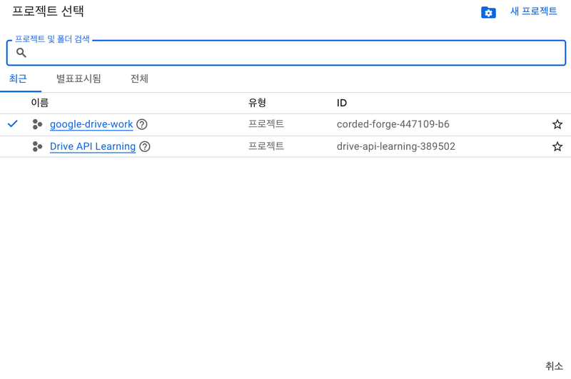

3. 프로젝트 정보 입력:
   - **프로젝트 이름**: 원하는 이름 입력 (예: `my-oauth-app`)
   - **위치**: 조직 선택 (없으면 "조직 없음" 선택)
4. **"만들기"** 버튼을 클릭합니다.

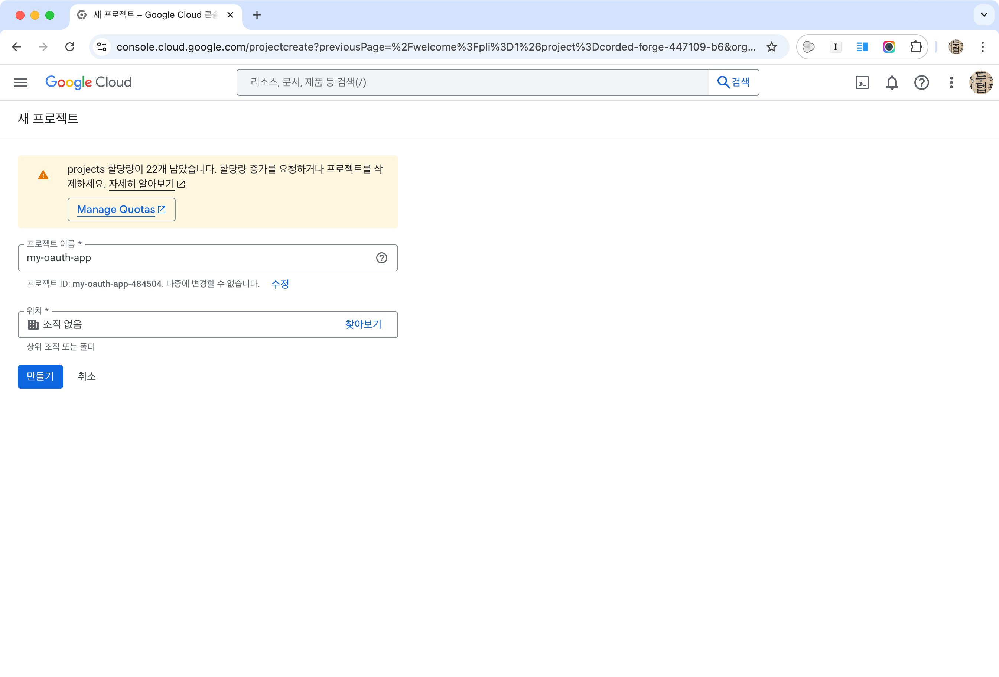

5. 프로젝트 생성이 완료되면 자동으로 선택됩니다 (약 1-2분 소요).

6. 프로젝트 생성이 완료되면 자동으로 선택됩니다.

---

## 3. OAuth 프로젝트 구성 (앱 정보 입력)

OAuth를 사용하려면 먼저 프로젝트를 구성하고 앱 정보를 입력해야 합니다.

### 3.1 클라이언트 메뉴로 이동

1. 좌측 메뉴에서 **"클라이언트"** 탭을 클릭합니다.

> 💡 **참고**: 또는 좌측 메뉴에서 **"API 및 서비스"** > **"사용자 인증 정보"**를 클릭한 후 **"클라이언트"** 탭으로 이동합니다.

2. 아직 앱이 생성되지 않은 상태이므로 **"시작하기"** 버튼이 표시됩니다.

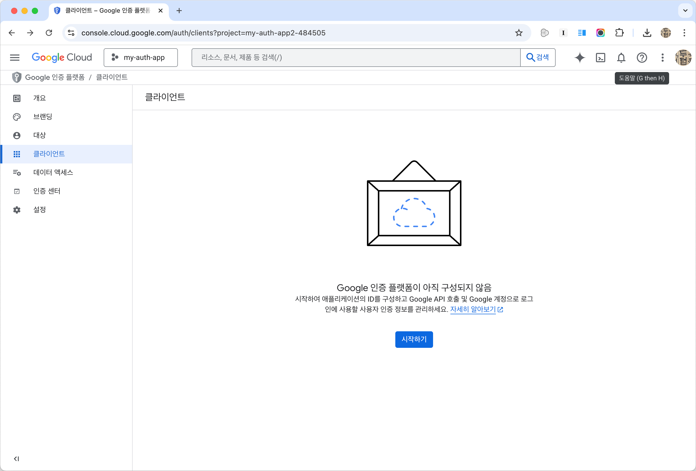

3. **"시작하기"** 버튼을 클릭합니다.

### 3.2 프로젝트 구성 - 앱 정보 입력

**"프로젝트 구성"** 섹션이 나타나며, 먼저 **"앱 정보"**를 입력합니다.

1. 다음 정보를 입력합니다:
   - **앱 이름**: 사용자에게 표시될 앱 이름 (예: `내 OAuth 테스트 앱`)
   - **사용자 지원 이메일**: 사용자가 문의할 이메일 주소

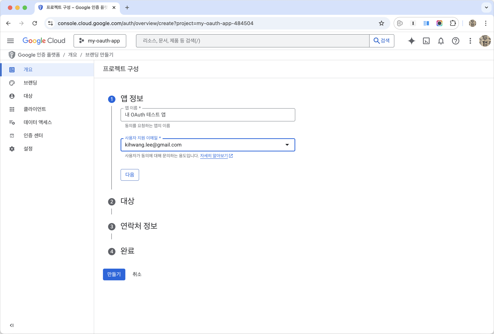

2. **"다음"** 버튼을 클릭합니다.

### 3.3 프로젝트 구성 - 대상 (사용자 유형)

**"프로젝트 구성"** 섹션의 **"대상"** 항목을 설정합니다.

1. **"외부"** 또는 **"내부"** 선택:
   - **외부**: 일반 사용자(Gmail 계정)가 로그인 가능
   - **내부**: Google Workspace 조직 내 사용자만 로그인 가능
   
   > 💡 **개인 프로젝트나 테스트용**: "외부" 선택
   
   > 💡 **회사 내부용**: "내부" 선택 (Google Workspace 계정 필요)

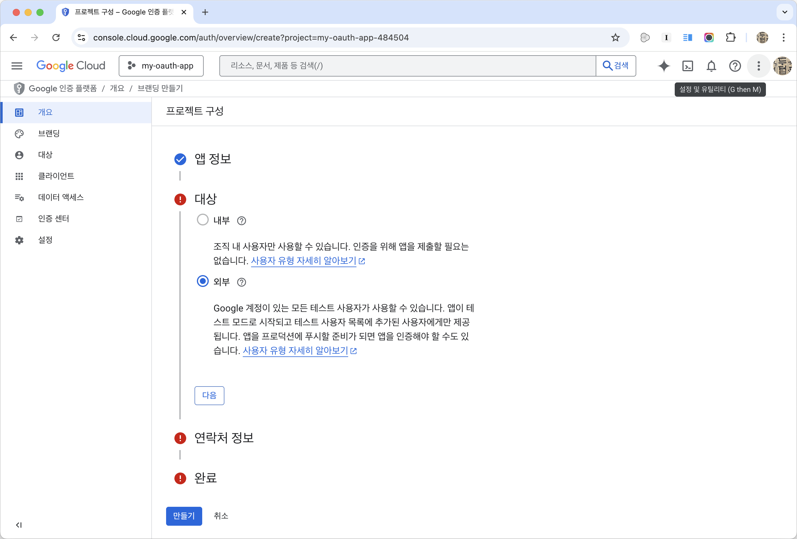

2. **"다음"** 버튼을 클릭합니다.

### 3.4 프로젝트 구성 - 연락처 정보

**"프로젝트 구성"** 섹션의 **"연락처"** 항목을 설정합니다.

1. 다음 정보를 입력합니다:
   - **연락처 이메일**: 앱 관련 문의사항을 받을 이메일 주소
   - **앱 로고** (선택사항): 120x120px 이미지
   - **앱 홈페이지** (선택사항): 앱 웹사이트 URL
   - **개인정보처리방침 링크** (선택사항): 개인정보처리방침 페이지 URL
   - **서비스 약관 링크** (선택사항): 서비스 약관 페이지 URL

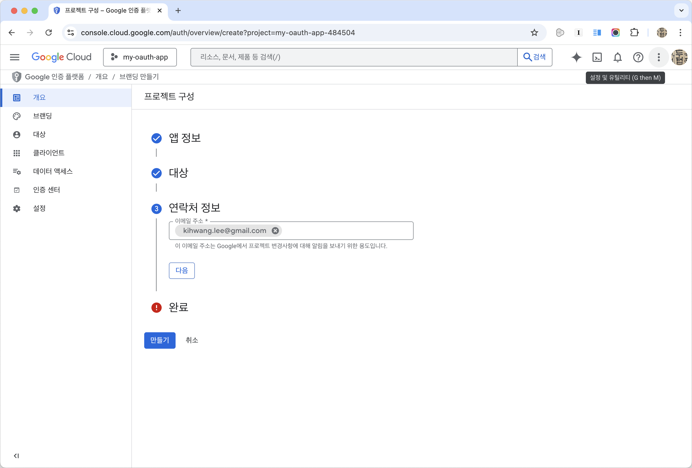

2. **"다음"** 버튼을 클릭합니다.

### 3.5 완료 단계

**4단계: 완료**

1. **"Google API 서비스: 사용자 데이터 정책"** 체크박스를 클릭하여 동의합니다.

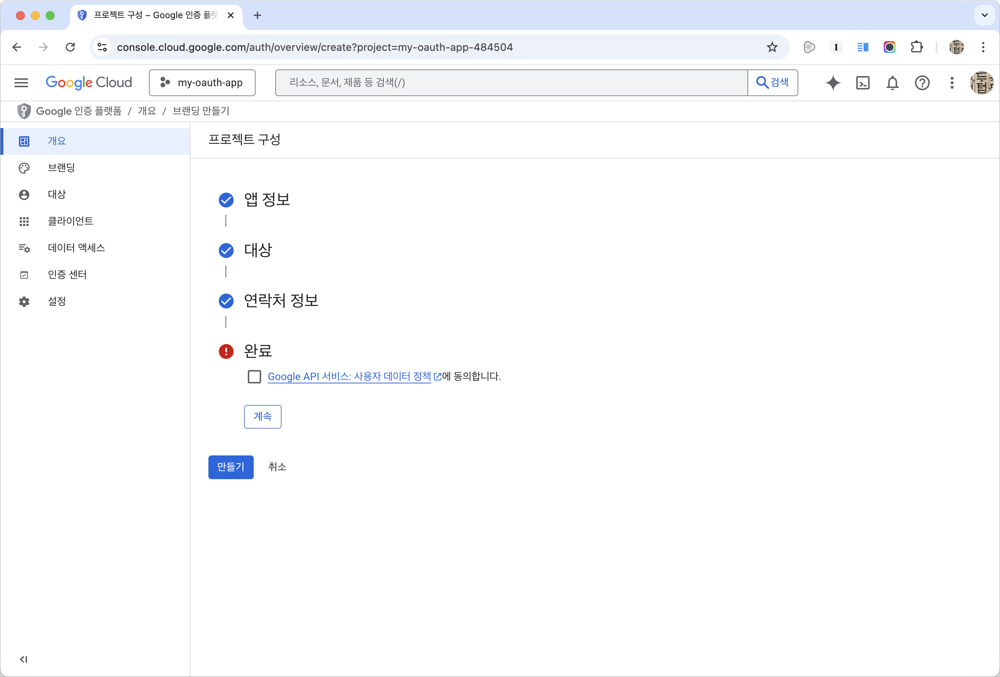

2. **"계속"** 버튼을 클릭합니다.

3. 다음 화면에서 **"만들기"** 버튼을 클릭합니다.

프로젝트 구성이 완료되었습니다. 이제 OAuth 클라이언트 ID를 생성할 수 있습니다.

---

## 4. OAuth 클라이언트 ID 생성

이제 실제로 사용할 클라이언트 ID와 시크릿을 생성합니다.

### 4.1 OAuth 클라이언트 ID 생성

프로젝트 구성이 완료된 후 **"클라이언트"** 탭 화면에서 OAuth 클라이언트 ID를 생성할 수 있습니다.

**"OAuth 클라이언트 만들기"** 버튼을 클릭하면 **"OAuth 클라이언트 ID 만들기"** 화면이 나타납니다.

### 4.3 애플리케이션 유형 선택

1. **애플리케이션 유형** 드롭다운 메뉴에서 **"웹 애플리케이션"** 선택

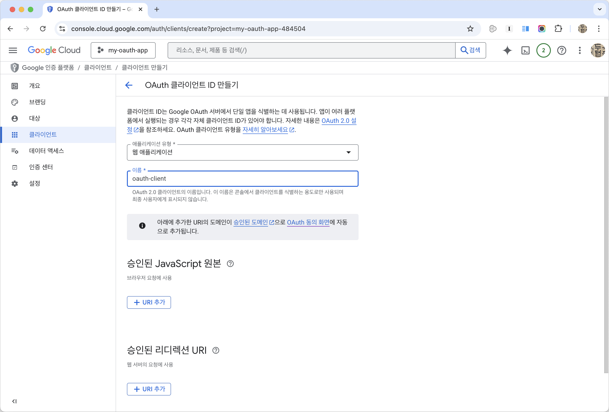

2. **이름**: 클라이언트 이름 입력 (예: `oauth-client`)

클라이언트 이름을 입력하면 아래에 두 개의 섹션이 나타납니다:
- **승인된 Javascript 원본**
- **승인된 리디렉션 URI**

### 4.4 승인된 리디렉션 URI 추가

**가장 중요한 단계입니다!**

1. **"승인된 리디렉션 URI"** 섹션에서 **"URI 추가"** 버튼을 클릭합니다.
2. 다음 URI를 추가합니다:

   ```
   http://localhost:8000/callback
   ```

   > 💡 **참고**: 
   - 예제 코드(`src/google_oauth.py`)는 기본적으로 `http://localhost:8000`에서 실행됩니다.
   - 콜백 경로는 `/callback`으로 설정되어 있습니다.
   - 프로덕션 환경에서는 `https://yourdomain.com/callback` 형식으로 추가하세요.

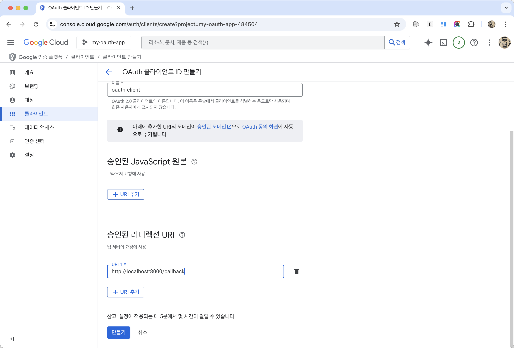

3. **"만들기"** 버튼을 클릭합니다.

### 4.5 클라이언트 ID와 시크릿 확인

생성이 완료되면 다음 정보가 표시됩니다:

- **클라이언트 ID**: `123456789-abcdefghijklmnop.apps.googleusercontent.com` (이 형식)
- **클라이언트 보안 비밀번호**: `GOCSPX-xxxxxxxxxxxxxx` (이 형식)

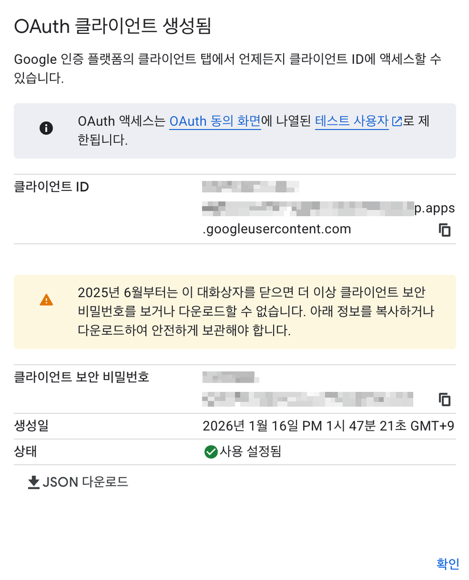

⚠️ **중요**: 
- **클라이언트 보안 비밀번호**는 이 화면에서만 확인할 수 있습니다.
- 반드시 복사하여 안전한 곳에 저장하세요 (다음 단계에서 .env 파일에 입력합니다).

4. 확인 화면을 닫으면, 방금 생성한 클라이언트가 **클라이언트 목록**에 나타납니다.

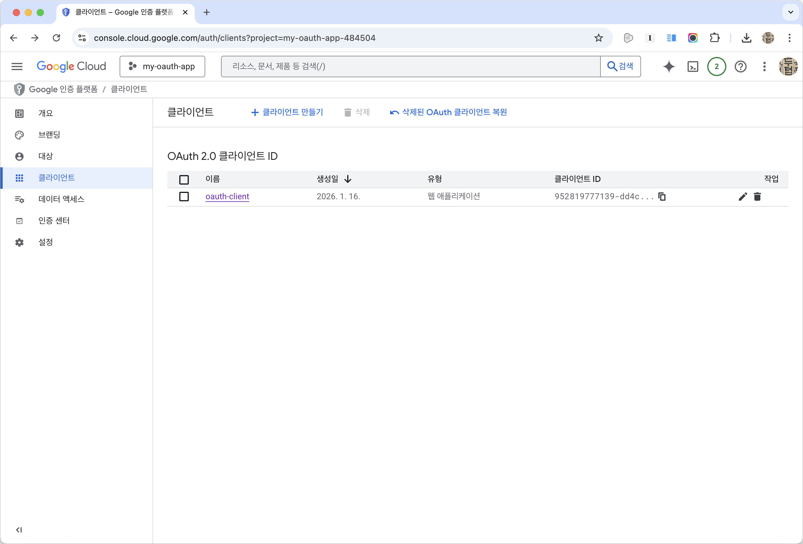

> 💡 **참고**: 이후 클라이언트 ID와 시크릿을 다시 확인하거나 수정하려면 클라이언트 목록에서 해당 클라이언트를 클릭하면 됩니다. 다만 클라이언트 보안 비밀번호는 처음 생성 시에만 확인할 수 있으므로, 반드시 안전하게 보관하세요.

---

### 4.6 테스트 사용자 추가 (외부 앱인 경우)

OAuth 클라이언트 ID 생성이 완료되었습니다. 이제 **외부 앱**의 경우 테스트 사용자를 추가해야 합니다.

### 4.6.1 대상 메뉴로 이동

1. 좌측 메뉴에서 **"대상"** 탭을 클릭합니다.

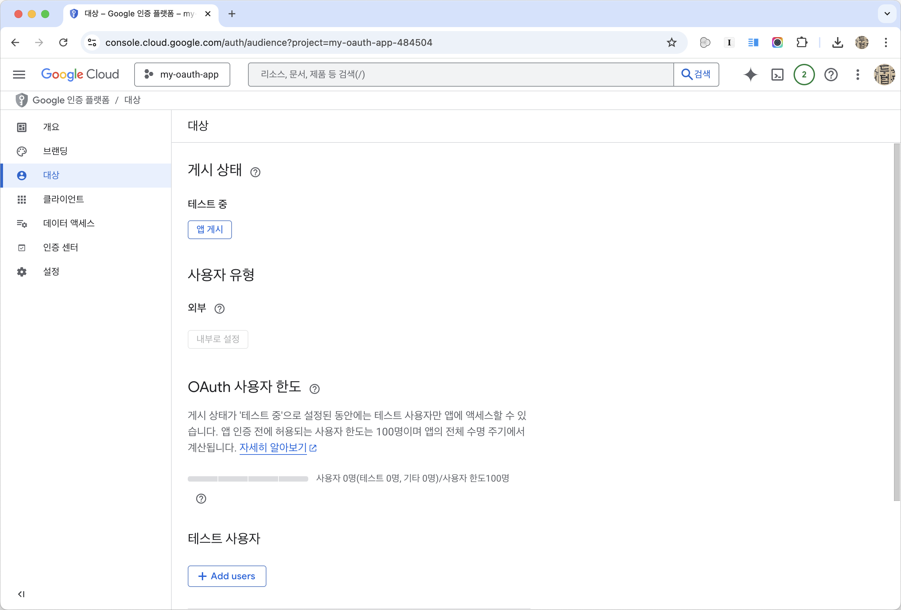

### 4.6.2 앱 상태 확인

**"대상"** 화면에서 다음 정보를 확인할 수 있습니다:

- **게시 상태**: **"테스트 중"**으로 표시됨
- **앱 게시** 버튼: 앱을 프로덕션으로 게시할 때 사용
- **사용자 유형**: **"외부"**로 표시됨
- **OAuth 사용자 한도**: 테스트 중일 때 제한 사항 표시

### 4.6.3 테스트 사용자 추가

**"테스트 사용자"** 섹션에서 테스트할 사용자를 추가합니다.

1. **"Add users"** 버튼을 클릭합니다.
2. 테스트할 Google 계정 이메일 주소를 입력합니다.
3. **"저장"** 버튼을 클릭합니다.

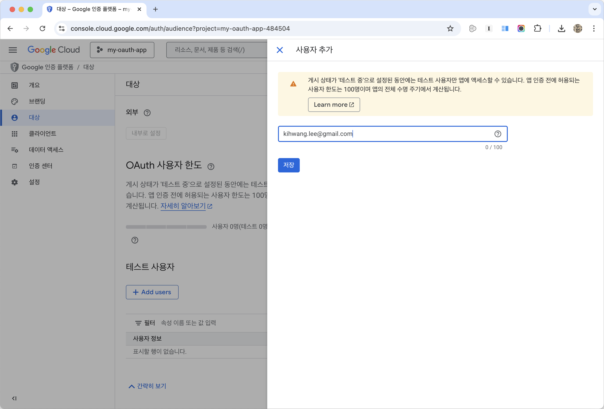

> ⚠️ **중요**: 
> - 앱이 **"테스트 중"** 상태일 때는 테스트 사용자로 추가된 계정만 로그인할 수 있습니다.
> - 여러 사용자를 추가하려면 각각 추가하거나, 쉼표로 구분하여 여러 이메일을 한 번에 입력할 수 있습니다.

---

### 4.7 범위(Scope) 설정

OAuth 클라이언트 ID 생성이 완료되었습니다. 이제 애플리케이션이 요청할 데이터 범위(Scope)를 설정합니다.

### 4.7.1 데이터 억세스 메뉴로 이동

1. 좌측 메뉴에서 **"데이터 억세스"** 탭을 클릭합니다.

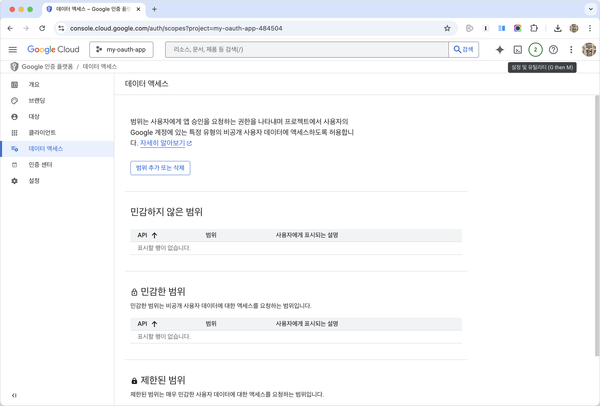

### 4.7.2 범위 추가 또는 삭제

**"데이터 억세스"** 화면에서 **"범위 추가 또는 삭제"** 버튼이 보입니다.

1. **"범위 추가 또는 삭제"** 버튼을 클릭합니다.
2. 필요한 범위를 선택합니다:

   기본 범위 (프로필 정보):
   - ✅ `openid` - OpenID Connect 인증
   - ✅ `email` - 사용자 이메일 주소
   - ✅ `profile` - 기본 프로필 정보 (이름, 프로필 사진 등)

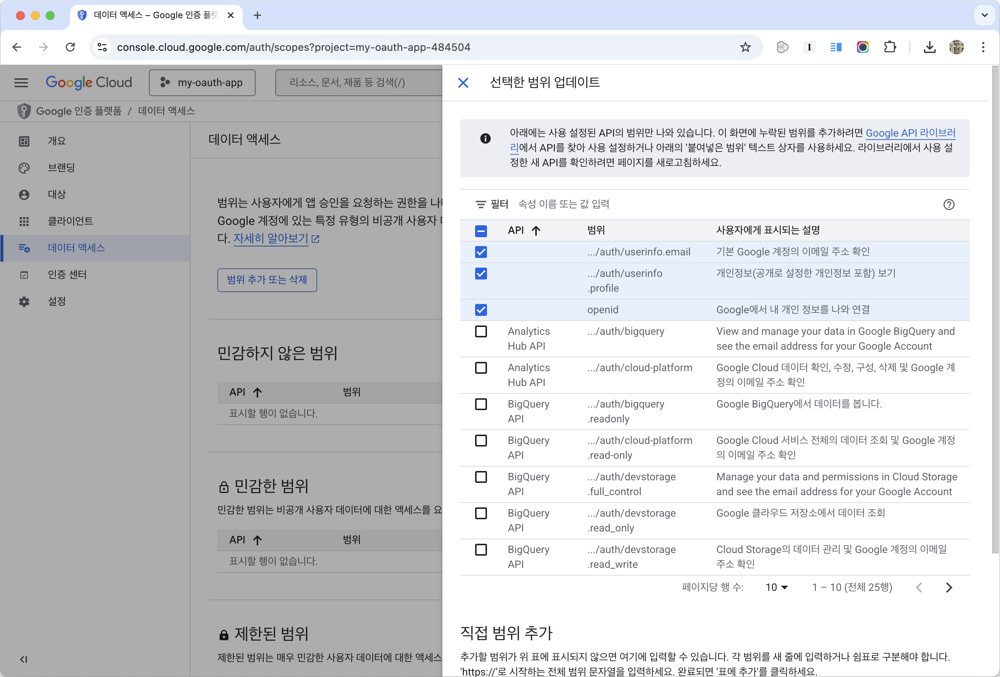

3. **"업데이트"** 버튼을 클릭합니다.
4. **"Save"** 버튼을 클릭하여 변경 사항을 저장합니다.

> ⚠️ **주의**: 
> - 민감한 범위(예: Google Drive, Gmail 읽기)는 Google 검수가 필요합니다.
> - 학습용으로는 기본 범위(`openid`, `profile`, `email`)만 사용하세요.

---

## 5. 환경 변수 설정

이제 발급받은 클라이언트 ID와 시크릿을 환경 변수로 설정합니다.

### 7.1 .env 파일 생성

프로젝트 루트 디렉토리에 `.env` 파일을 생성합니다:

```bash
# 프로젝트 루트에서
touch .env
```

### 7.2 .env 파일에 값 입력

`.env` 파일을 열고 다음 내용을 입력합니다:

```env
# Google OAuth 설정
GOOGLE_CLIENT_ID=123456789-abcdefghijklmnop.apps.googleusercontent.com
GOOGLE_CLIENT_SECRET=GOCSPX-xxxxxxxxxxxxxx
GOOGLE_REDIRECT_URI=http://localhost:8000/callback
```

> ⚠️ **주의**: 
> - `GOOGLE_CLIENT_ID`와 `GOOGLE_CLIENT_SECRET`는 4.5단계에서 복사한 실제 값으로 교체하세요.
> - `.env` 파일은 절대 Git에 커밋하지 마세요! (`.gitignore`에 추가되어 있는지 확인)

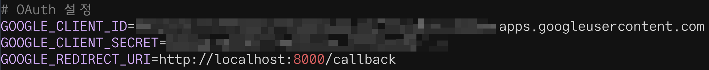

### 7.3 .gitignore 확인

`.gitignore` 파일에 `.env`가 포함되어 있는지 확인하세요:

```gitignore
.env
*.env
.env.local
```

---

## 6. 테스트 및 확인

이제 모든 설정이 완료되었습니다. 예제 코드를 실행해봅시다.

### 8.1 서버 실행

터미널에서 다음 명령어를 실행합니다:

```bash
python src/google_oauth.py
```

성공하면 다음과 같은 메시지가 표시됩니다:

```
INFO:     Started server process
INFO:     Uvicorn running on http://0.0.0.0:8000
```

### 8.2 로그인 테스트

1. 웹 브라우저에서 `http://localhost:8000/login` 접속
2. Google 로그인 페이지로 리디렉션됩니다
3. Google 계정 선택 및 권한 승인
4. `/callback`으로 리디렉션되며 사용자 정보가 JSON 형식으로 표시됩니다

### 8.3 예상 응답

성공 시 다음과 같은 JSON 응답을 받습니다:

```json
{
  "id": "123456789012345678901",
  "email": "user@example.com",
  "verified_email": true,
  "name": "홍길동",
  "given_name": "길동",
  "family_name": "홍",
  "picture": "https://lh3.googleusercontent.com/...",
  "locale": "ko"
}
```

### 8.4 OAuth 인증 흐름도

```
1. 사용자 → http://localhost:8000/login 접속
2. 서버 → Google 로그인 페이지로 리디렉션
3. 사용자 → Google 계정 선택 및 권한 승인
4. Google → http://localhost:8000/callback?code=xxx 로 리디렉션
5. 서버 → code를 액세스 토큰으로 교환
6. 서버 → 액세스 토큰으로 사용자 정보 조회
7. 서버 → 사용자 정보를 JSON으로 반환
```

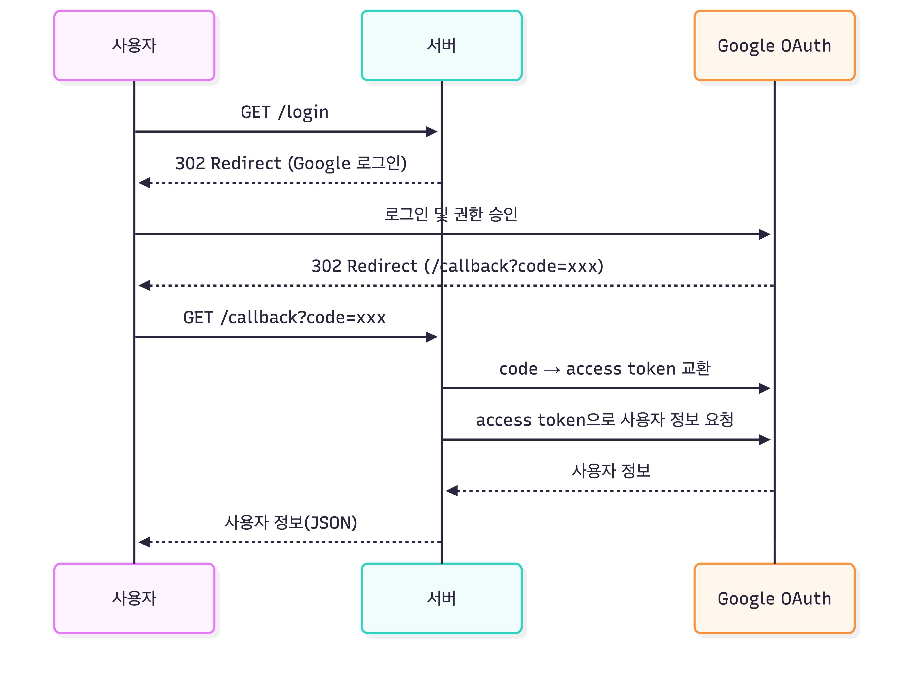

---

## 7. 문제 해결 (FAQ)

### Q1: `redirect_uri_mismatch` 오류 발생

**증상:**
```
Error 400: redirect_uri_mismatch
```

**해결 방법:**
1. Google Cloud Console에서 등록한 Redirect URI와 코드의 URI가 **정확히 일치**하는지 확인:
   - `http://localhost:8000/callback` ← 정확히 동일해야 함
   - `http://localhost:8000/callback/` ← 끝에 슬래시 있으면 오류
   - `https://localhost:8000/callback` ← http vs https 차이
2. 클라이언트 ID 설정에서 Redirect URI 수정/추가
3. 브라우저 캐시 삭제 후 재시도

### Q2: `invalid_client` 오류 발생

**증상:**
```
Error 401: invalid_client
```

**해결 방법:**
1. `.env` 파일의 `GOOGLE_CLIENT_ID`와 `GOOGLE_CLIENT_SECRET`가 올바른지 확인
2. 클라이언트 시크릿에 공백이나 줄바꿈이 없는지 확인
3. 환경 변수가 제대로 로드되었는지 확인:
   ```python
   print(os.getenv('GOOGLE_CLIENT_ID'))  # None이 아니어야 함
   ```

### Q3: `access_denied` 오류 발생

**증상:**
```
Error 403: access_denied
```

**해결 방법:**
1. **외부 앱 + 테스트 중 상태**인 경우:
   - OAuth 동의 화면에서 테스트 사용자로 이메일 추가 필요
   - 테스트할 Google 계정이 테스트 사용자 목록에 있는지 확인
2. 사용자가 권한 승인을 거부한 경우 → 다시 시도

### Q4: 토큰이 7일 후 만료됨

**증상:**
```
Refresh token expires after 7 days
```

**해결 방법:**
1. 앱이 **"테스트 중"** 상태이면 토큰이 7일 후 만료됩니다
2. 장기 토큰을 사용하려면:
   - OAuth 동의 화면에서 앱을 **"프로덕션"**으로 게시
   - Google 검수 과정 필요 (민감한 scope 사용 시)

### Q5: scope 관련 오류

**증상:**
```
Error: invalid_scope
```

**해결 방법:**
1. 요청한 scope가 OAuth 동의 화면에 추가되었는지 확인
2. 민감한 scope 사용 시 Google 검수 완료 여부 확인
3. 기본 scope (`openid profile email`)만 사용하는 것이 안전

### Q6: 서버가 시작되지 않음

**증상:**
```
ModuleNotFoundError: No module named 'fastapi'
```

**해결 방법:**
1. 필요한 패키지 설치:
   ```bash
   pip install fastapi uvicorn python-dotenv requests
   ```
2. 또는 `requirements.txt`에서 설치:
   ```bash
   pip install -r requirements.txt
   ```

### Q7: `.env` 파일이 인식되지 않음

**증상:**
환경 변수가 `None`으로 표시됨

**해결 방법:**
1. `.env` 파일이 프로젝트 루트 디렉토리에 있는지 확인
2. `python-dotenv` 패키지가 설치되었는지 확인:
   ```bash
   pip install python-dotenv
   ```
3. 파일 경로 확인:
   ```python
   from pathlib import Path
   print(Path('.env').exists())  # True여야 함
   ```

---

## 8. 추가 자료

### 공식 문서

- [Google Identity - OAuth 2.0](https://developers.google.com/identity/protocols/oauth2)
- [OpenID Connect](https://developers.google.com/identity/openid-connect/openid-connect)
- [OAuth 동의 화면 설정](https://developers.google.com/identity/protocols/oauth2/openid-connect#consentflow)
- [FastAPI 공식 문서](https://fastapi.tiangolo.com/)

### 관련 파일

- 예제 코드: `src/google_oauth.py`
- API 가이드: `doc/api_guide.md`

---

**문제가 해결되지 않았나요?** 

- Google Cloud Console의 [문제 해결 가이드](https://developers.google.com/identity/protocols/oauth2/policies)를 참고하세요.
- FastAPI 공식 문서의 [OAuth 예제](https://fastapi.tiangolo.com/advanced/security/oauth2-scopes/)를 확인하세요.

---

**마지막 업데이트**: 2024년
